# A3DP XY Gantry Assembly Guide

> **NOTE:**
> This guide provides step-by-step instructions for assembling the XY gantry of the A3DP 3D Printer. The process is broken down into modular sub-assemblies. Gather your Bill of Materials (BOM) for each section and follow the outlined steps.
> 
> *The machine you are building now will be a reflection of the effort committed to assembling it. Attention to detail is directly related to both the performance of the machine and its longevity.*

---

## General Assembly Information

Before starting the assembly, please review the following guidelines to ensure a reliable and accurate build.

> **IMPORTANT:**
> **Threadlocker:**
>
> When securing bolts into metal components (such as motor faces or milled aluminum plates), applying threadlocking compound is highly recommended. Do **not** use red/high-strength threadlocker, as it may permanently bind the bolts. Apply only a small drop to the leading threads before securing fasteners:
>
> * **5mm bolts:** Use a medium-strength threadlocker such as [Loctite 243 (Blue)](https://kb-3d.com/store/tools-equipment/773-loctite-threadlocker-243-medium-blue-6ml-1673749510230.html?affp=6182).
>
> * **3mm bolts:** Use a low-strength threadlocker such as [Loctite 222MS (Purple)](https://kb-3d.com/store/tools-equipment/774-loctite-threadlocker-222ms-low-strength-purple-mil-spec-6ml-1673749510419.html?affp=6182).
>
>
> **Warning:** Ensure threadlocker does *not* come into contact with 3D printed components. Many threadlockers can cause rapid chemical degradation in plastics unless specified (especially ABS, ASA, and Polycarbonate).

> **TIP:**
> **Shimming and Frame Inconsistencies:**
>
> The BOM specifies `M5x7x0.3mm Shims` to properly space the idler stacks. However, due to manufacturing tolerances, you may find that the gap diverges slightly. 
> * Keep an assortment of precision M5 shims (0.3mm, 0.4mm, 0.5mm) on hand if possible.
> * Add or swap shims to ensure bearings and idlers spin freely without excessive vertical wobble or binding. A loose component can be just as problematic as an overly tightened one.

> **CAUTION:**
> **Fastener Torque Specifications:**
>
> Correct torque is critical for frame rigidity and preventing component damage. **WARNING:** The custom milled aluminum plates use somewhat delicate M3 and M5 threading. Overtightening will permanently strip the aluminum threads and deform the bearing races, ruining the hardware! Do not exceed these limits:
>
> * **M3 Fasteners:** Tighten to approximately **1.0 to 1.5 Nm**.
>
> * **M5 Fasteners:** Tighten to approximately **3.0 to 4.5 Nm**.
>
> * **Idler Shafts/Shoulder Bolts:** Snug them down securely to firmly clamp the inner races of the bearings and shims, but verify the entire idler stack can still rotate freely.

> **WARNING:**
> **Belt Tensioning Guidelines:**
>
> Proper belt tension prevents ringing, skipping, and premature mechanical wear. **Do not over-tension the belts!** Excessive tension causes rapid wear on bearings and can permanently damage stepper/servo motor shafts.
> * **6mm Belts:** Rough target tension is **110Hz** over a 150mm unsupported span. They should feel taut but springy.
> * **9mm Belts:** Require higher tension (~**130Hz - 140Hz** over a 150mm span) for optimal stiffness. *Note: Advanced dual-shear 9mm configurations may require tensions in excess of **200Hz**.*

---

## Voron Printer Upgrades

If you are using these A3DP gantry parts to upgrade an existing Voron printer, please note the following critical frame modification for the Trident only:

> **IMPORTANT:**
> **Voron Trident Frame Modification:**
>
> When replacing the Trident gantry system, the **rear vertical 2020 extrusion must be shortened by 9mm**. This is necessary to accommodate the offset introduced by the new A3DP gantry hardware.  This only applies to the extrusion where the rear linear rail mounts, and not the entire frame.
> 
> *Note: This modification is **not required** on the Voron 2.4, as it utilizes a flying/floating gantry design.*

> **TIP:**
> **Enclosure Panel Clearance:**
>
> The new XY joints may overhang slightly more than stock parts and could make contact with your side enclosure panels. Ensure there is approximately **6mm of additional clearance** between the frame and the panels. You can easily compensate for this by using thick weatherstripping and printing the 6mm extended versions of the panel mounting clips provided with the Voron documentation.

---

## Table of Contents

1. [Left Hand Side Front (LHS_Front)](#1-left-hand-side-front-lhs_front)
2. [Right Hand Side Front (RHS_Front)](#2-right-hand-side-front-rhs_front)
3. [Front Tensioner Setup](#3-front-tensioner-setup)
4. [Left Hand Side Rear (LHS_Rear)](#4-left-hand-side-rear-lhs_rear)
5. [Right Hand Side Rear (RHS_Rear)](#5-right-hand-side-rear-rhs_rear)
6. [X-Y Joint Left (XY_LHS)](#6-x-y-joint-left-xy_lhs)
7. [X-Y Joint Right (XY_RHS)](#7-x-y-joint-right-xy_rhs)
8. [X-Axis Carriage (X_Carriage)](#8-x-axis-carriage-x_carriage)
9. [CoreXY Final Tuning & Best Practices](#9-corexy-final-tuning--best-practices)

---

## 1. Left Hand Side Front (LHS_Front)

*This section details the assembly of the left tensioner and front-left gantry components.*

### 📦 Bill of Materials

| Item | Qty | Description |
| :--- | :---: | :--- |
| 5mm x 35mm (M4 threaded) Shoulder Bolt | 1 | Long shoulder bolt for idler stack |
| M4 Nylon Lock Nut | 1 | For shoulder bolt |
| M3x8mm SHCS | 2 | Screws for standoff |
| M3x29mm Standoff (Hexagonal) | 1 | Vertical brace |
| M5x14mm Shim | 1 | For idler stack (top) |
| M5x0.3mm Shim | 1 | For idler stack (bottom) |
| M5x10mm SHCS | 2 | Top extrusion mount |
| M5x20mm SHCS | 2 | Bottom extrusion mount spacer |
| M5 Roll In T-Nuts | 4 | Extrusion Mounting |
| 2GT Idler - 9mm - Smooth | 1 | |
| LHS Front Milled Parts | 1 set | (1) Base Plate, (1) Top Plate, (1) Spacer Block, (2) Belt Clamps |

### 🛠️ Assembly Instructions

> **NOTE:**
> Ensure each idler/pulley has a shim or spacer installed on both sides.  No rubbing should occur between the idler flange and other parts.
>
> Shoulder bolts shall be inserted so that the cutout feature secures against the anti-rotation tab.
>
> The belt clamp plate is optional when assembling on a fixed gantry printer; however, it is recommended to preserve the face if the gantry is reused for other projects.
>
> It is critical that the front idler assemblies are mounted perfectly square to the frame and gapped equally from the extrusion ends on both sides. Failure to do so will result in belt path misalignment.

#### Step 1.1: Bearing Insertion and Alignment
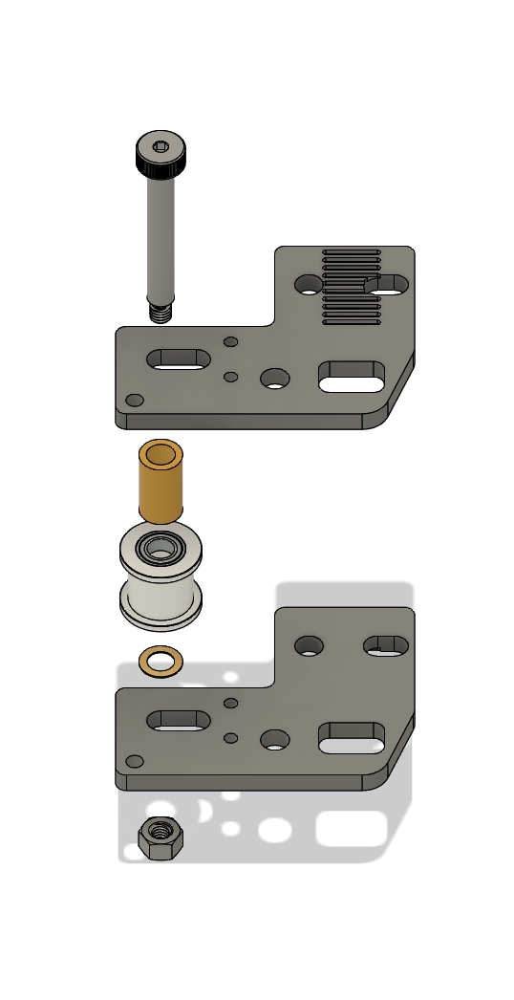

#### Step 1.2: Exploded Parts Assembly
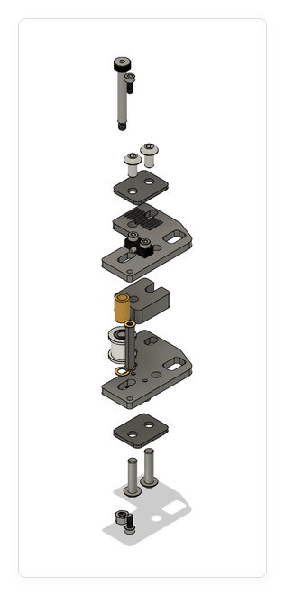

#### Step 1.3: Complete the LHS Front Sub-assembly
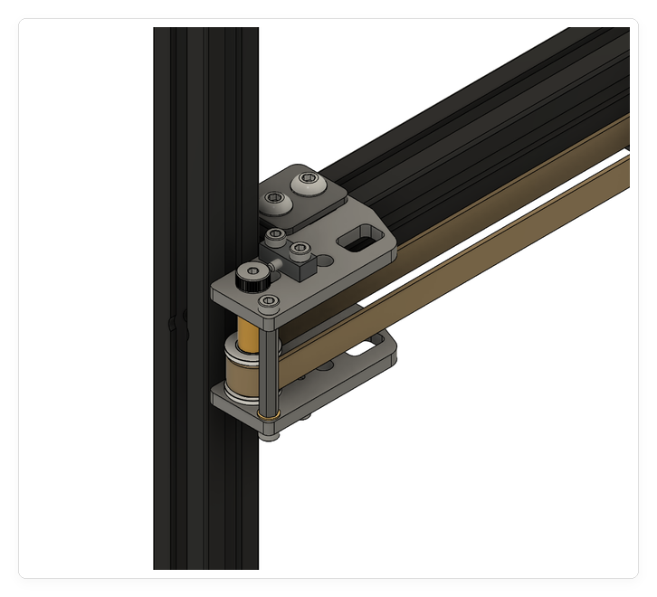

---

## 2. Right Hand Side Front (RHS_Front)

*This section details the assembly of the right tensioner and front-right gantry components.*

### 📦 Bill of Materials

| Item | Qty | Description |
| :--- | :---: | :--- |
| 5mm x 30mm (M4 threaded) Shoulder Bolt | 1 | Long shoulder bolt for idler stack |
| M4 Nylon Lock Nut | 1 | For shoulder bolt |
| M3x8mm SHCS | 2 | Screws for standoff |
| M3x20mm Standoff (Hexagonal) | 1 | Vertical brace |
| M5x0.3mm Shim | 1 | For idler stack (top) |
| M5x8mm Shim | 1 | For idler stack (bottom) |
| M5x10mm SHCS | 4 | Top & bottom extrusion mount |
| M5 Roll In T-Nuts | 4 | Extrusion Mounting |
| 2GT Idler - 9mm - Smooth | 1 | |
| RHS Front Milled Parts | 1 set | (1) Base Plate, (1) Top Plate, (2) Belt Clamps |

### 🛠️ Assembly Instructions

> **NOTE:**
> Ensure each idler/pulley has a shim or spacer installed on both sides.  No rubbing should occur between the idler flange and other parts.
>
> Shoulder bolts shall be inserted so that the cutout feature secures against the anti-rotation tab.
>
> The belt clamp plate is optional when assembling on a fixed gantry printer; however, it is recommended to preserve the face if the gantry is reused for other projects.
>
> It is critical that the front idler assemblies are mounted perfectly square to the frame and gapped equally from the extrusion ends on both sides. Failure to do so will result in belt path misalignment.

#### Step 2.1: Bearing Insertion and Alignment
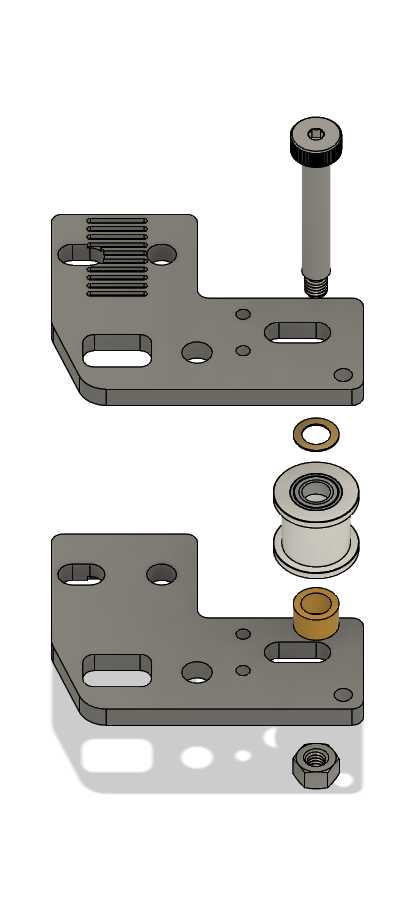

#### Step 2.2: Exploded Parts Assembly
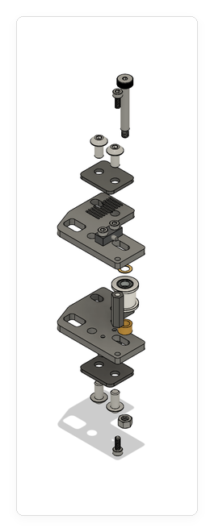

#### Step 2.3: Complete the RHS Front Sub-assembly
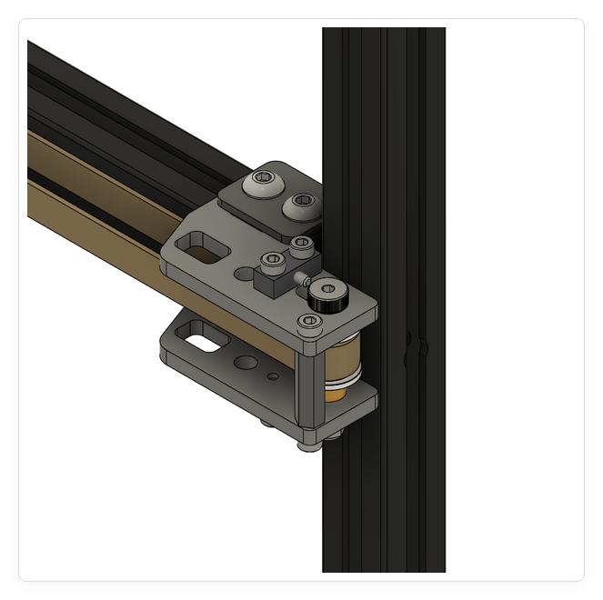

---

## 3. Front Tensioner Setup

*This section details the tensioner installation for the front idler assemblies.*

### 📦 Bill of Materials

| Item | Qty | Description |
| :--- | :---: | :--- |
| Tensioner Block | 4 (2 each) | Top and Bottom Block for LHS and RHS |
| M3x8mm SHCS | 4 (2 each) | For tension block |
| M2.5x10mm SHCS | 4 (2 each) | For belt tension |

### 🛠️ Assembly Instructions

> **NOTE:**
> This step is performed on **both** front idlers (Left and Right) on top and bottom.
> 
> Thread M2.5x10mm screw through the block to adjust belt tension. 
>
> **Pro-Tip:** Leave tensioner screw at the fully relaxed position until ready to run and tension belts. 
>
> **Pro-Tip:** When setting belt tension, use incremental adjustments such as 1/4 turn at a time on top and bottom and then check belt tension. 

#### Step 3.1: Mount Tensioner Components
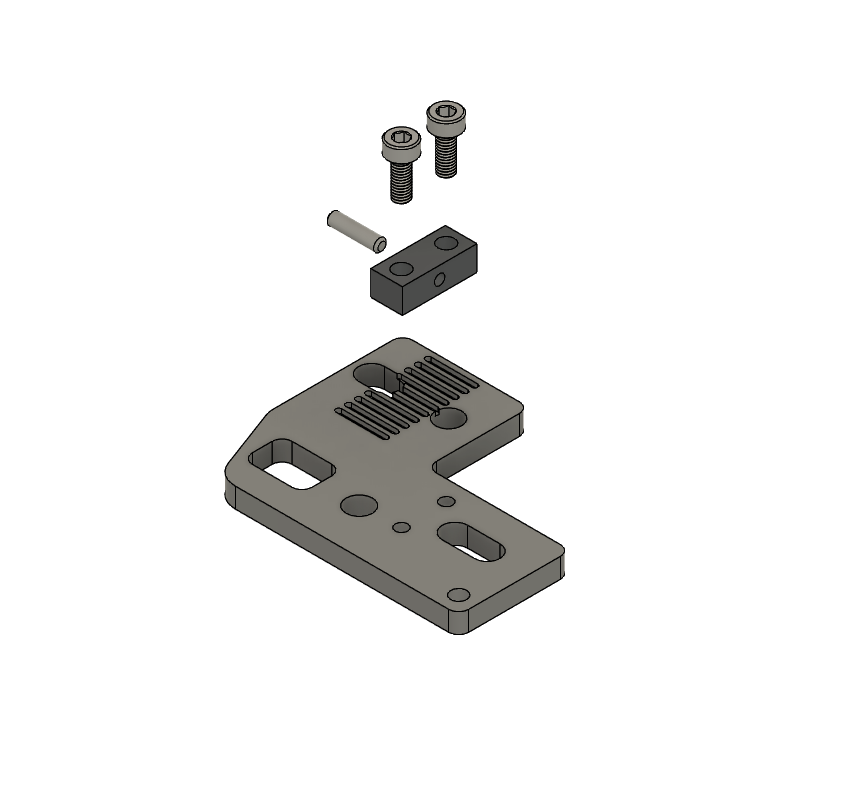

## 4. Left Hand Side Rear (LHS_Rear)

*This section covers the rear-left stepper motor mounts and idlers.*

### 📦 Bill of Materials

| Item | Qty | Description |
| :--- | :---: | :--- |
| A3DP Servo or NEMA 17 Stepper Motor | 1 | Left Y-axis motor |
| 2GT Pulley - 20 Tooth - 9mm | 1 | 5mm Bore |
| 2GT Idler - 9mm - Smooth | 3 | 5mm Bore |
| M3x8mm SHCS | 5 | Motor mounting & retaining clip |
| 5mm x 28mm Retaining Pin | 1 | For outer idler stack | 
| 5mm x 37mm Retaining Pin | 1 | For inner idler stack | 
| M5x10mm BHCS/SHCS | 8 | Extrusion mounting |
| M5x20mm BHCS/SHCS | 2 | Bottom extrusion mount spacer |
| M5 Roll In T-Nuts | 10 | Extrusion mounting |
| M5x0.3mm Shims | 4 | One on each side of the idler |
| M5x5mm Shims | 1 | Inside the idler stack - top |
| Retaining Clip | 1 | Printed Part |
| LHS Rear Milled Parts | 1 set | (1) LHS-Motor Base Plate, (1) LHS-Motor Top Plate, (1) Spacer Block, (2) Belt Clamps |

### 🛠️ Assembly Instructions

> **NOTE:**
> Ensure each idler/pulley has a shim or spacer installed on both sides.  No rubbing should occur between the idler flange and other parts.
>
> Retaining pins shall be inserted so that the cutout feature secures against the anti-rotation tab.
>
> The belt clamp plate is optional when assembling on a fixed gantry printer; however, it is recommended to preserve the face if the gantry is reused for other projects.
>
> **Pro-Tip:** It is recommended not to tighten down the motor pulleys until you are ready to time and square the gantry, as described in the **CoreXY Final Tuning & Best Practices** section.

#### Step 4.1: Bearing Insertion and Alignment
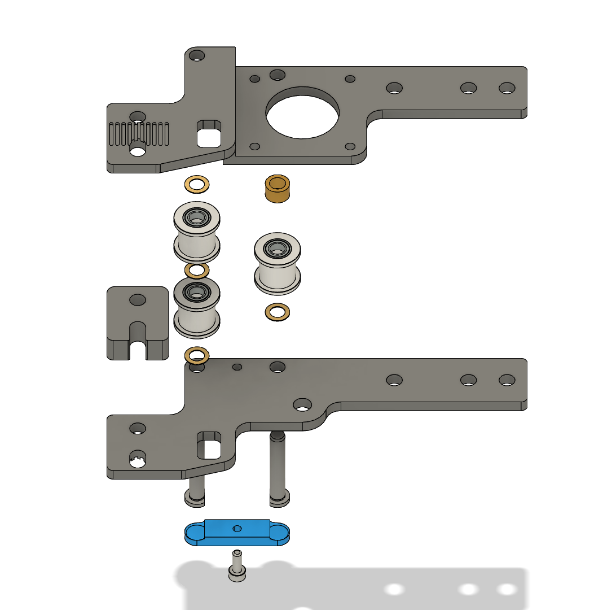

#### Step 4.2: Exploded Parts Assembly
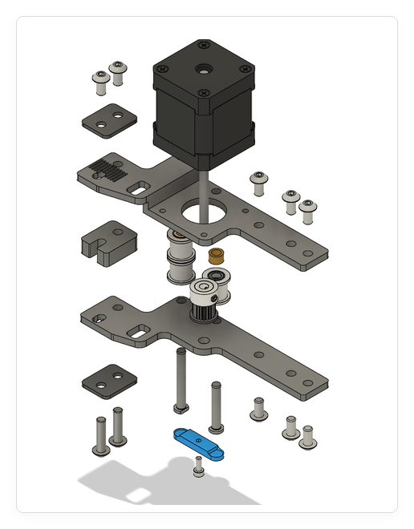

#### Step 4.3: Complete the LHS Rear Sub-assembly
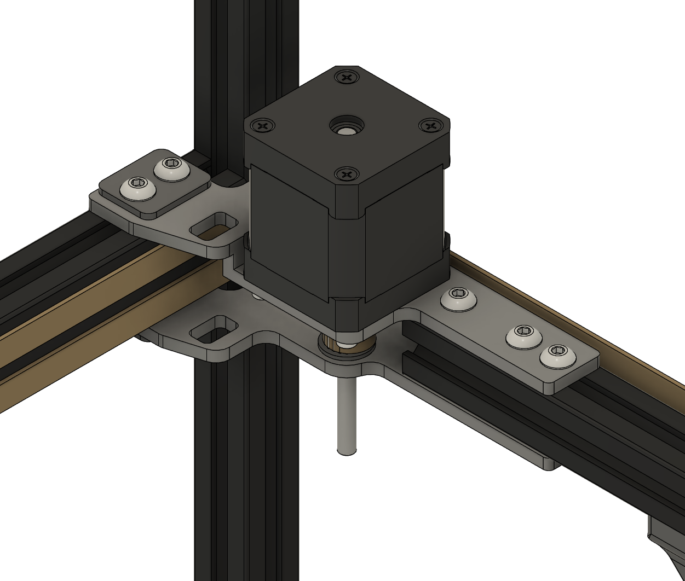

---

## 5. Right Hand Side Rear (RHS_Rear)

*This section covers the rear-right stepper motor mounts and idlers.*

### 📦 Bill of Materials

| Item | Qty | Description |
| :--- | :---: | :--- |
| A3DP Servo or NEMA 17 Stepper Motor | 1 | Right Y-axis motor |
| 2GT Pulley - 20 Tooth - 9mm | 1 | 5mm Bore |
| 2GT Idler - 9mm - Smooth | 3 | 5mm Bore |
| M3x8mm SHCS | 5 | Motor mounting & retaining clip |
| 5mm x 37mm Retaining Pin | 2 | For outer & inner idler stack | 
| M5x10mm BHCS/SHCS | 8 | Extrusion mounting |
| M5x20mm BHCS/SHCS | 2 | Bottom extrusion mount spacer |
| M5 Roll In T-Nuts | 10 | Extrusion mounting |
| M5x0.3mm Shims | 4 | One on each side of the idler |
| M5x14mm Shim | 1 | For inner idler stack (top) |
| Retaining Clip | 1 | Printed Part |
| RHS Rear Milled Parts | 1 set | (1) RHS-Motor Base Plate, (1) RHS-Motor Top Plate, (1) Spacer Block, (2) Belt Clamps |

### 🛠️ Assembly Instructions

> **NOTE:**
> Ensure each idler/pulley has a shim or spacer installed on both sides.  No rubbing should occur between the idler flange and other parts.
>
> Retaining pins shall be inserted so that the cutout feature secures against the anti-rotation tab.
>
> The belt clamp plate is optional when assembling on a fixed gantry printer; however, it is recommended to preserve the face if the gantry is reused for other projects.
>
> **Pro-Tip:** It is recommended not to tighten down the motor pulleys until you are ready to time and square the gantry, as described in the **CoreXY Final Tuning & Best Practices** section.

#### Step 5.1: Bearing Insertion and Alignment
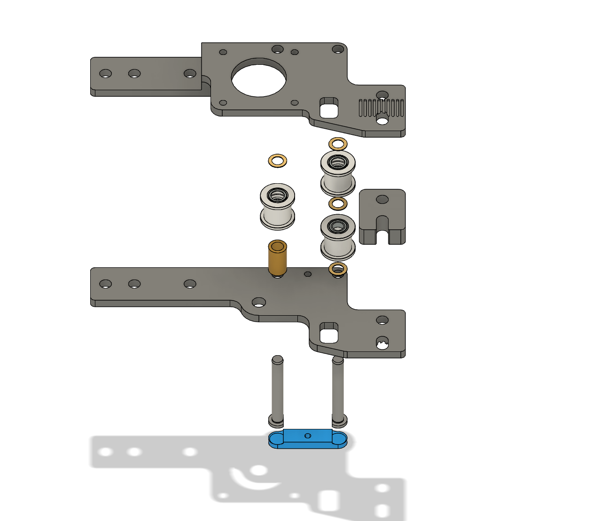

#### Step 5.2: Exploded Parts Assembly
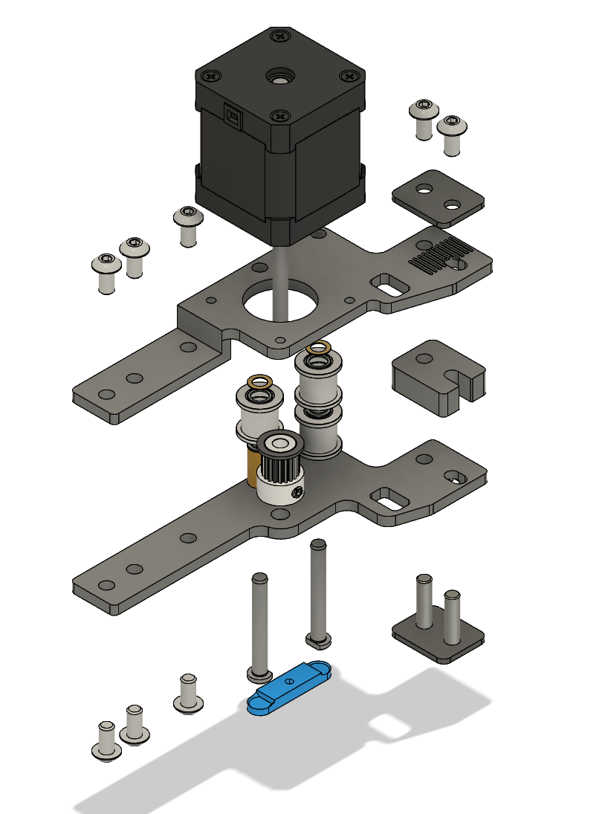

#### Step 5.3: Complete the RHS Rear Sub-assembly
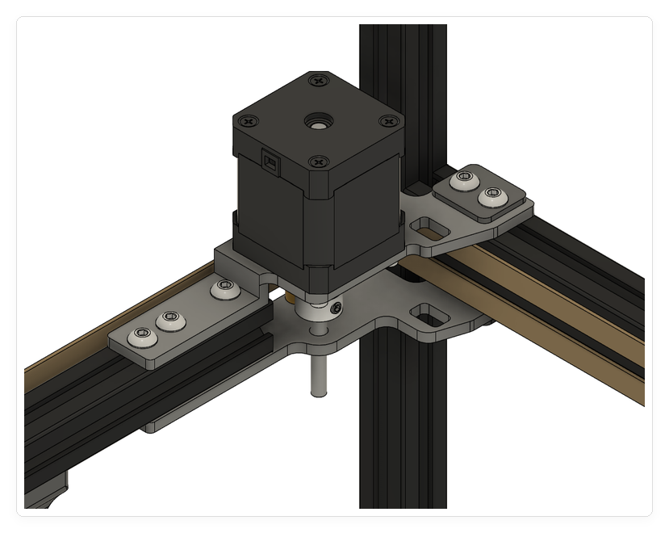

---

## 6. X-Y Joint Left (XY_LHS)

*These joints connect the left Y-axis constraints with the main X-axis crossbeam.*

### 📦 Bill of Materials

| Item | Qty | Description |
| :--- | :---: | :--- |
| 2GT Idler - 20 Tooth - 9mm | 1 | 5mm Bore |
| 2GT Idler - 9mm - Smooth | 1 | 5mm Bore |
| M5x0.3mm Shims | 4 | |
| M5 x 22mm Retaining Pin | 2 | |
| M3 x 8mm SHCS | 4 | Carriage mount |
| XY LHS Joint Milled Bracket | 1 | Main joint block |

### 🛠️ Assembly Instructions

> **NOTE:**
> Ensure each idler/pulley has a shim or spacer installed on both sides.  No rubbing should occur between the idler flange and other parts.
>
> Retaining pins shall be inserted so that the cutout feature secures against the anti-rotation tab.  This keeps the pins from rotating and working out of the mount.
>
> **Pro-Tip:** Do NOT tighten the hardware connecting the joint to the carriage all the way yet. Wait until the X-axis is mostly assembled, then pull the gantry to the front or rear of the printer to square everything up on both sides before final tightening.

#### Step 6.1: Joint Bearing Setup
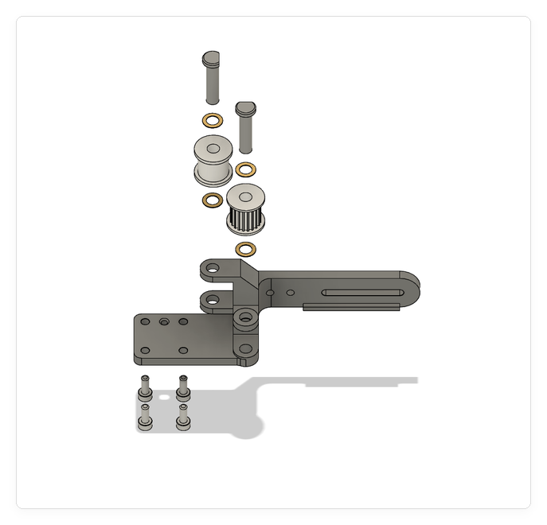

#### Step 6.2: Secure the Front Side of the Joint
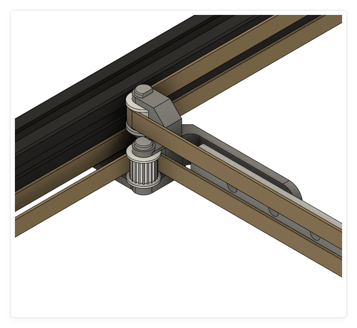

#### Step 6.3: Secure the Rear Side of the Joint
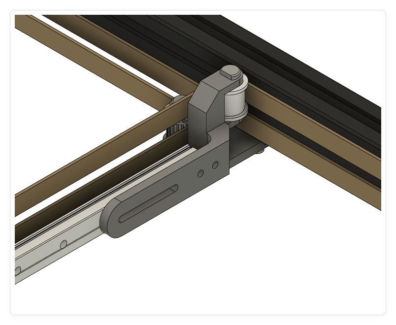

---

## 7. X-Y Joint Right (XY_RHS)

*These joints connect the right Y-axis constraints with the main X-axis crossbeam.*

### 📦 Bill of Materials

| Item | Qty | Description |
| :--- | :---: | :--- |
| 2GT Idler - 20 Tooth - 9mm | 1 | 5mm Bore |
| 2GT Idler - 9mm - Smooth | 1 | 5mm Bore |
| M5x0.3mm Shims | 4 | |
| M5 x 22mm Retaining Pin | 2 | |
| M3 x8mm SHCS | 4 | Carriage mount |
| XY RHS Joint Milled Bracket | 1 | Main joint block |

### 🛠️ Assembly Instructions

> **NOTE:**
> Ensure each idler/pulley has a shim or spacer installed on both sides.  No rubbing should occur between the idler flange and other parts.
>
> Retaining pins shall be inserted so that the cutout feature secures against the anti-rotation tab.  This keeps the pins from rotating and working out of the mount.
>
> **Pro-Tip:** Do NOT tighten the hardware connecting the joint to the carriage all the way yet. Wait until the X-axis is mostly assembled, then pull the gantry to the front or rear of the printer to square everything up on both sides before final tightening.

#### Step 7.1: Joint Bearing Setup
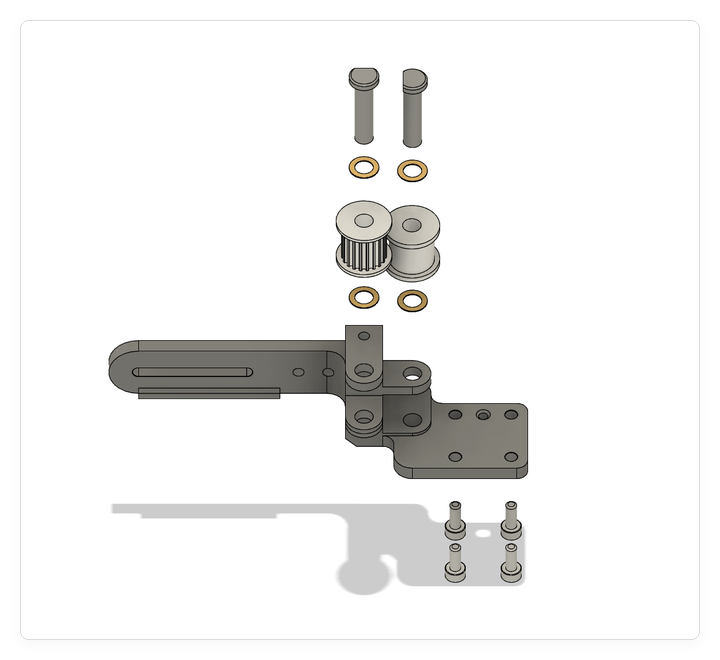

#### Step 7.2: Secure the Front Side of the Joint
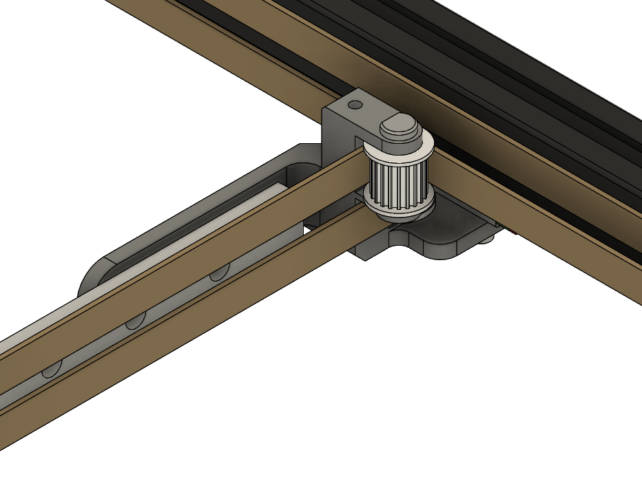

#### Step 7.3: Secure the Rear Side of the Joint
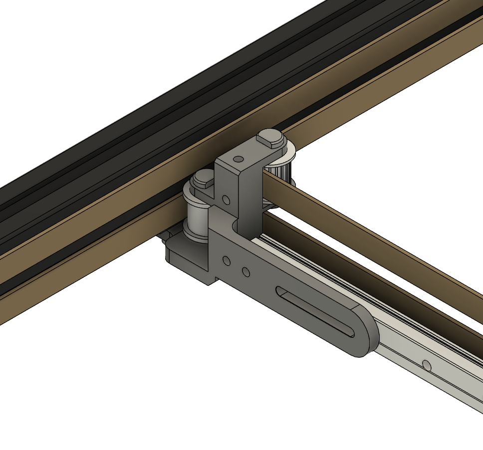

---

## 8. X-Axis Carriage (X_Carriage)

*The central toolhead mount connecting to the X-axis linear rails.*

### 📦 Bill of Materials

| Item | Qty | Description |
| :--- | :---: | :--- |
| Linear Rail Carriage Block | 1 | MGN12H |
| M3x8mm SHCS | 8 | Carriage/hotend mounting |
| 2mm x 10mm Locating Pin | 2 | Hotend mount alignment |
| X Carriage Milled Parts | 1 set | (1) Carriage Mount, (1) Hotend Mount |

### 🛠️ Assembly Instructions

> **NOTE:**
> **Alignment Pins:** Always use the included alignment pins when joining the carriage sections to guarantee correct geometry.
>
> **Pro-Tip:** It is highly recommended to route and install the belts into the carriage clamps *prior* to fully fastening the carriage assembly down to the linear rail block.

#### Step 8.1: Assemble the Toolhead Mount
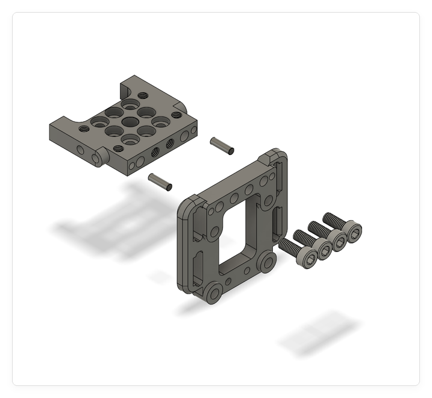

#### Step 8.2: Assemble the Carriage Mount
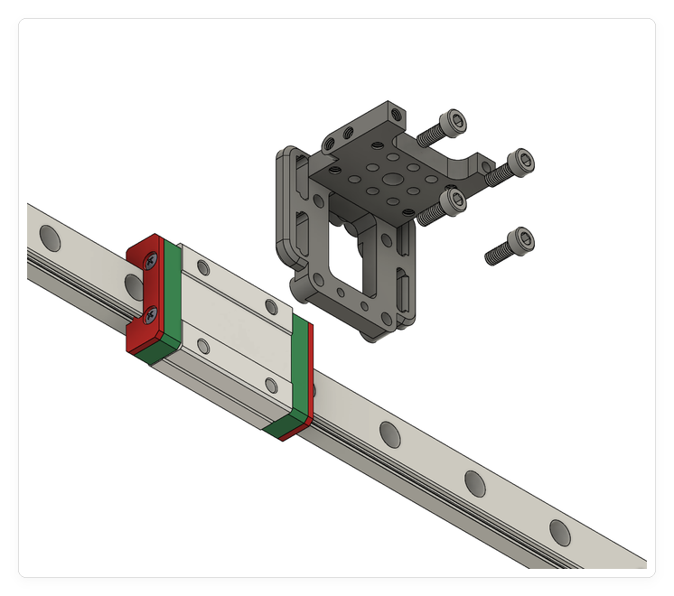

---

## 9. CoreXY Final Tuning & Best Practices

*After mechanically assembling the gantry, you must tune the kinetic system before running your machine. These steps are standard for CoreXY printers but are critical for achieving quality prints.*

> **IMPORTANT:**
> **Belt Pathing & Alignment**
> Verify that your A and B belt paths are routed correctly and aligned.
> * There are only **two toothed idlers** in the entire belt path (one for each side). **Every other idler should be smooth**. Ensure the smooth side of the belt rides against smooth idlers, and the toothed side rides against toothed idlers/pulleys. Running the toothed side over a smooth idler will imprint pattern artifacts.
> * Ensure the **belt clamps** on the X-axis carriage are secured as closely as possible without interfering with carriage horizontal travel. Do not install the clamps in a way that aggressively pinches or deforms the belts or belt path. Deformed belts exiting the carriage will introduce uneven tension and elastic backlash.
>
> **Verifying Belt Tension**
> With the gantry squared correctly, you must verify equal tension across the A and B belts via a frequency gauge (or microphone app). 
> * Move the toolhead to the mechanical center of your print volume.
> * Pluck each belt at the longest 150mm unsupported span.
> * Adjust tensioner blocks on the front XY joints until both belts ring at the exact same pitch (e.g., ~110Hz for 6mm belts, ~140Hz for standard 9mm belts, or >200Hz for dual-shear 9mm systems). Uneven tension will twist the X-axis and induce skew into the printing plane.

> **CAUTION:**
> **Squaring the Gantry (De-racking)**
> A critical step in a CoreXY build is ensuring the gantry is perfectly square. If the X-axis carriage is out of square with the Y-axis rails, you will experience binding, noisy movements, and dimensionally incorrect prints or other defects. 
> 1. Bring the X-axis carriage close to the front of the Y-axis constraints.
> 2. Loosen the grubs/screws on your stepper motor pulleys so they can spin freely on their shafts.
> 3. Pull both Y-axis carriages firmly against their front mechanical hard-stops.
> 4. While holding the carriages tight against the stops, re-tighten the motor pulleys. This effectively squares ("de-racks") the gantry.

> **TIP:**
> **Lubricating Linear Rails**
> Before completing the build, verify if your carriage blocks shipped with factory oil or legitimate lubricant (like Mobilux EP1 or SuperLube). If they only shipped in transport oil, you must clean and relube them. Operating dry or poorly lubricated linear rails significantly reduces their lifespan and has a direct impact on print quality.

---

**End of Guide.**

***

> ☕ **Did you find this guide helpful?** 
> 
> My projects are open-source and free for the community. If you've enjoyed my designs and want to support my work, consider [leaving me a tip on Ko-fi](https://ko-fi.com/alchemical3d)! 
>
> 
